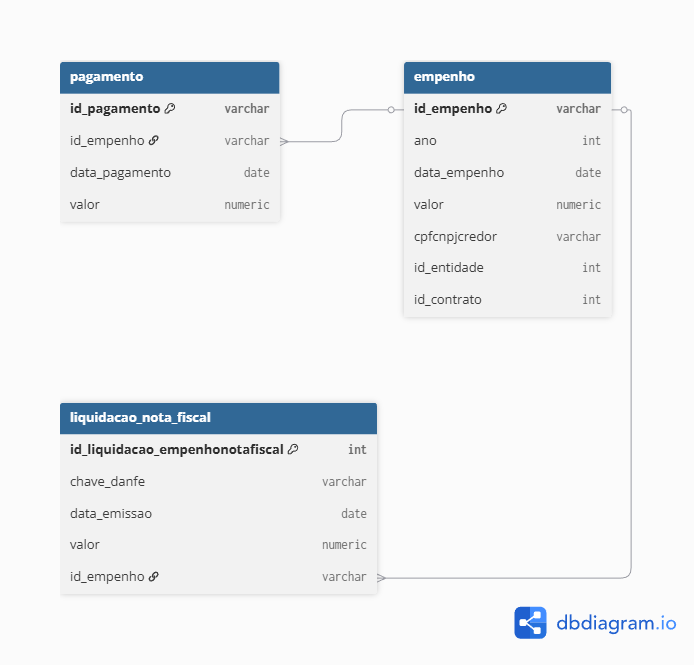

# Diagrama de Modelagem de Dados

O diagrama abaixo representa o modelo relacional utilizado no desafio, com foco no fluxo da despesa pública, tendo as etapas de empenho, liquidação e pagamento.

O empenho foi definido como a entidade central do modelo, relacionando-se diretamente com as tabelas de liquidação e pagamento, permitindo acompanhar a execução da despesa ao longo do tempo.

